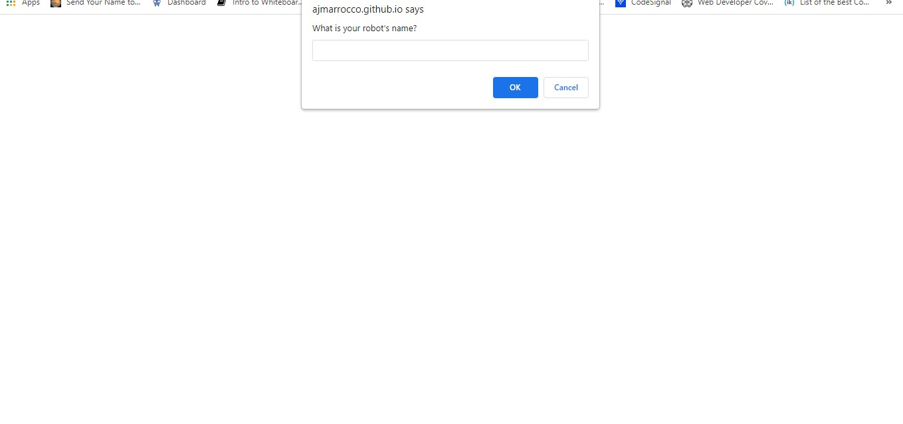

# Robot Gladiators

## Table of Contents
* [Description](#description)
* [Technologies Used](#technologies-used)
* [Installation](#installation)
* [Usage](#usage)
* [Contributing](#contributing)
* [Deployed Url](#deployed-url)
* [Images](#images)
* [Questions](#questions)

### Description
A browser-based game that uses JavaScript that allows you to fight other robots, buy health or upgrade your attack!

### Technologies Used
* JavaScript

### Installation
1. Clone repository using `git@github.com:ajmarrocco/robot-gladiators.git`
2. Open index.html in default browser

### Usage 
All dependencies must be installed prior to using application

### Contributing 
Pull requests are reviewed

## Deployed Url
https://ajmarrocco.github.io/robot-gladiators/

### Images

### Questions
If you have any questions about opening an issue or the repository itself, please contact me at ajmarrocco@gmail.com. Please visit https://github.com/ajmarrocco for more of my projects!